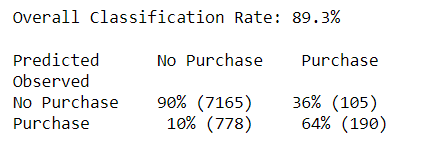

# Sagemaker XGBoost Implementation for predicting Bank Customer Behavior

### Overview

In this mini-project we used a sample dataset provided by AWS, which contains 60 columns of data about approximately 41,000 bank customers, and whether or not they enrolled for a particular bank product.

The objective was to use __AWS Sagemaker__ to create an XGBoost Model which can effectively predict whether customers enrolled for the bank product.

__Steps taken:__
- Preparation
  - Launch AWS Sagemaker Notebook Instance
  - Create S3 bucket for storing data and artefacts
  - Load dataset from AWS
  - Format data in accordance with Sagemaker requirements
- Basic EDA
- Split data, define training inputs and store in S3
- Model Setup
  - retrieve XGBoost Image
  - define hyperparameters and output path
  - define model parameters and resources
- Train Model
- Model Evaluation
  - Deploy model to server and create endpoint
  - Use model to make predictions and get accuracy score
- Clean-up: delete and / or deactivate utilized AWS resources

### Model Performance

Using the XGBoost Classifier, we were able to achieve the following performance:  
  
As the primary objective was to gain an understanding of the basic workings of AWS Sagemaker, no additional time was invested in optimizing the model.
 
### Learnings from Project

The primary learnings from this project included:
- creation of XGBoost model using AWS container and EC2 instances including evaluation of instant types (memory- vs compute-bound)
- storage and uploading of inputs and outputs in S3
- creation of model endpoint which can be used for prediction purposes
- cleanup, i.e. shutting down of AWS artifacts / resources when they are not being used

Using the boto3 SDK, the model creation, deployment etc. with AWS seems pretty straightforward. What was surprising to me is the amount of time required for starting / stopping notebook instances and starting model training. On the other hand, model training can of course be completed much faster due to the additional compute power.

#### Next Steps
Additional avenues which would be interesting to pursue include methods for Hyperparameter tuning as well as other tools provided by AWS Sagemaker and Sagemaker studio.

